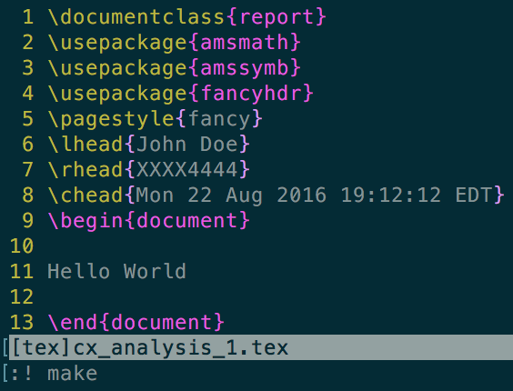

###What's This?

This is a shell script for quickly generating an environment for typesetting
in LaTeX, with an emphasis on quickly writing homework assignments. For 
example, suppose you want to typeset the first assignment for your complex
analysis course. Just type:
```
hwk cx_analysis_1
```

Now, when you type 'ls', you should see a new folder in your current working
directory called 'cx_analysis_1'. After entering the folder, you will see
a tex file and a make file:


There is no text in the body of the tex file, so calling 'make' won't yield
any obvious result. However, once we being editing our file, we can call
make in the current working directory, and our tex file will compile to a pdf,
which will then open in your default pdf viewer.

This is ideal for vim users as you can compile directly from the vim text
editor as pictured below:




This lets you skip most of your boilerplating, and also sets up a
makefile that consolidates all of your typesetting related command line
calls under one four letter word (make!), which is conveniently the same
for every tex project you start with `hwk` and does not require you to
remember how you formatted the name of your project (complex_analysis_a1?
cx_analysis_1? cxAnalysisA1?). This is also light on your vim command line
history, which can be useful when, for example, you need to recall a lot
of lengthy search and replace commands. Though these conveniences are
mild, they can really spare you a few headaches during long grinds where
you need to focus on a problem rather than the minutae of the typesetting
process.

###Installation and Adjustments

Just stick the `hwk` file wherever you keep your shell scripts. If you're
using a Mac OS X Mavericks, or a newer Mac OS, put it in the directory:
```
/usr/local/bin
```
For older Macs, and most Linux distros `/bin` should be fine.

Now, navigate to the directory you put `hwk` in, and make sure it's
executable. In the current working directory, the following command
should give everyone permission to read and execute the script, while
giving the root user sole permission to modify it.
```
chmod 755 hwk
```

From here, we can type:
```
hwk my_first_assignment
```
... and everything should work as it did in the preceding section.

Now we can get under the hood of this script and personalize it.
Open `hwk` in vim, or your favorite, inferior text editor. You
can fill in the field `Your Name` with (you guessed it) your name,
and you can fill in `Student ID` with your student ID or some other
relevant piece of information. The date is automatically generated
when you run `hwk`. You can call `man date` to learn about and implement
custom formatting options for the `date` command in your `hwk` script.

You can also modify the calls to echo and replace my package imports
with your own, or modify your generated makefiles. For example, if you're on
a Mac, you can add a `-g` flag to the `open` call in the makefile so
your pdf opens in the background, and you can keep working while it compiles.
By default, the call to open will pull you away from your text editor if you
are full screened, which is more suitable for smaller projects that compile
right away. If you're on a linux machine, you could replace any command line
calls that might break on your distro with a suitable equivalent. As an
example, Ubuntu users should replace `open` with `xdg-open`.

I hope you find some use for this script either as a typesetting tool, or a
jumping off point for a more personalized tool of your own.


